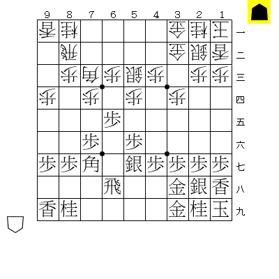
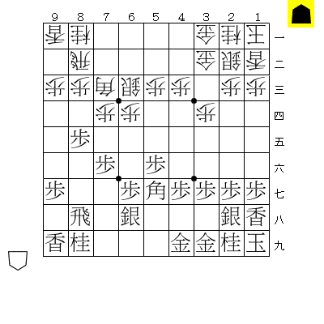
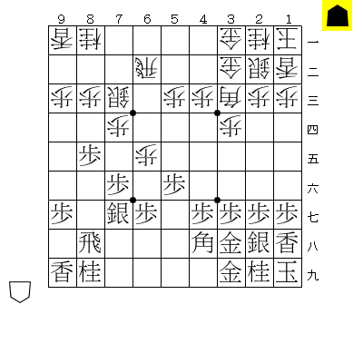
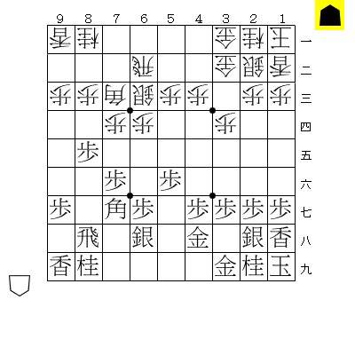
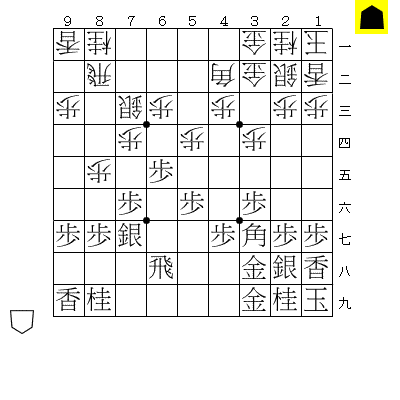
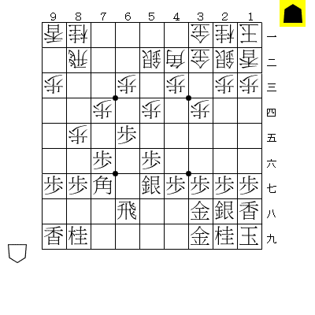
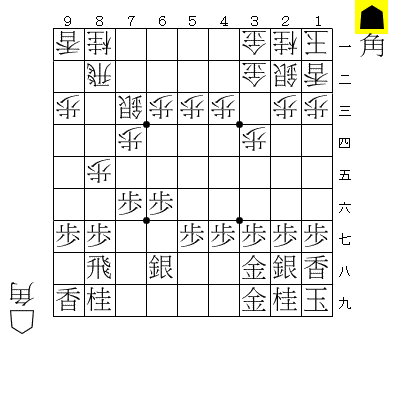
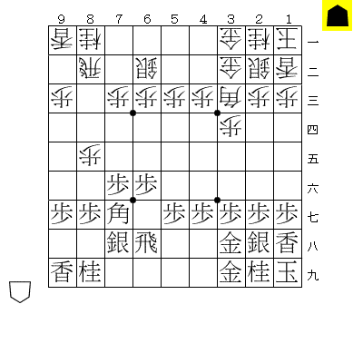
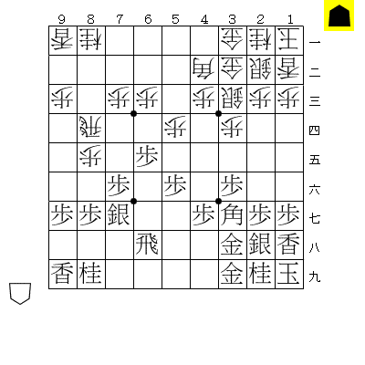

# 飛角銀のポジショニングと勝率

## 勝率の測定方法

- 局面を用意してelmo vs mafuで0.1秒200局で行う。(2秒にしてもあんまり変わらなかったので)
- 評価関数は強さが同じぐらい(R差150程度まで)で棋風が異なり定跡局面で強い方がいいのでelmoとmafuにした。
- 200局だと±3%程度の誤差と考えられるが、3%なんてもんじゃない差が出るのでこれで十分。

## 局面別勝率

いずれも先手の手番である。

### 振り飛車勝率60%程度

### 振り飛車勝率55%程度

### 振り飛車勝率50-53%程度

### 振り飛車勝率40%程度

### 振り飛車勝率30-35%程度

## 考察

### 局面と勝率から読み取れること

- 振り飛車側がドリーミングな局面でも勝率60%程度なのに、居飛車側に倒すと簡単に勝率30%を割るアンバランスさ。
- 飛車先が2つ突いてあることはそれだけで強い。
- 飛角の射線が合っていないと辛い。
- 銀が玉から離れると辛い。

### 物理的に変えられないこと

- 居飛車が飛角の射線を合わせるには、角の移動で2手必要。
- 振り飛車が飛角の射線を合わせるには、飛の移動で1手、角の移動で3手必要。
- この差は居飛車側の飛車先突き越しに費やされるが、これは相当なプラスである。
- 振り飛車が飛角の射線を合わせると、居飛車側の飛車先を銀で受けることになるが、銀のポジショニングの差は致命傷。

### 結論

- 囲い合ってから振り飛車有利の局面にするのは相当困難では。
