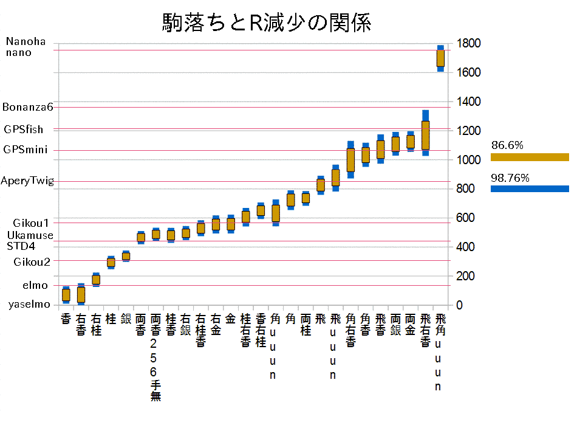

# Komaochi Theorem

駒落ちに関する理論。

# 基礎知識

## はじめに

- 香、角、飛、飛香、飛角(2枚)、飛角両香(4枚)、飛角両桂香(6枚)…という固定の手合いしかメジャーではなかった。
- もっと一般的な駒落ちに関する理論を深めることを目的とする。
- 駒落ちによるハンディキャップは振り飛車によるハンディキャップの理論に応用できる可能性がある。

## 駒落ちの表記法

- 駒落ちはA(左)B右C両Dと表記する。
- ABCDに入る文字列は飛角金銀桂香の順でソートされている。
- Aには飛、角が入る。
- Bがnullのとき左は書かない。Cがnullのとき右は書かない。Dがnullのとき両は書かない。
- 左は省略してもよい。Bには金、銀、桂、香が入り、それぞれ角側の駒を落とすことを表す。
- 右は省略できない。Cには金、銀、桂、香が入り、それぞれ飛側の駒を落とすことを表す。
- 両は省略できない。Dには金、銀、桂、香が入り、それぞれ両側の駒を落とすことを表す。
- B, C, Dの任意の2つの共通集合はnullである。BとCの共通はDに移せる。BとDの共通からBを消せる。CとDの共通からCを消せる。
- 歩落ちの表記はここでは定義しない。

以上のルールにより駒落ちの表記は左を書くか書かないかを除いて一意に定まる。  
駒落ち表記と対応するsfenを下に記す。

'平手': 'sfen lnsgkgsnl/1r5b1/ppppppppp/9/9/9/PPPPPPPPP/1B5R1/LNSGKGSNL b - 1'  
'香': 'sfen lnsgkgsn1/1r5b1/ppppppppp/9/9/9/PPPPPPPPP/1B5R1/LNSGKGSNL w - 1'  
'右香': 'sfen 1nsgkgsnl/1r5b1/ppppppppp/9/9/9/PPPPPPPPP/1B5R1/LNSGKGSNL w - 1'  
'桂': 'sfen lnsgkgs1l/1r5b1/ppppppppp/9/9/9/PPPPPPPPP/1B5R1/LNSGKGSNL w - 1'  
'右桂': 'sfen l1sgkgsnl/1r5b1/ppppppppp/9/9/9/PPPPPPPPP/1B5R1/LNSGKGSNL w - 1'  
'銀': 'sfen lnsgkg1nl/1r5b1/ppppppppp/9/9/9/PPPPPPPPP/1B5R1/LNSGKGSNL w - 1'  
'右銀': 'sfen ln1gkgsnl/1r5b1/ppppppppp/9/9/9/PPPPPPPPP/1B5R1/LNSGKGSNL w - 1'  
'金': 'sfen lnsgk1snl/1r5b1/ppppppppp/9/9/9/PPPPPPPPP/1B5R1/LNSGKGSNL w - 1'  
'右金': 'sfen lns1kgsnl/1r5b1/ppppppppp/9/9/9/PPPPPPPPP/1B5R1/LNSGKGSNL w - 1'  
'両香': 'sfen 1nsgkgsn1/1r5b1/ppppppppp/9/9/9/PPPPPPPPP/1B5R1/LNSGKGSNL w - 1'  
'両桂': 'sfen l1sgkgs1l/1r5b1/ppppppppp/9/9/9/PPPPPPPPP/1B5R1/LNSGKGSNL w - 1'  
'両銀': 'sfen ln1gkg1nl/1r5b1/ppppppppp/9/9/9/PPPPPPPPP/1B5R1/LNSGKGSNL w - 1'  
'両金': 'sfen lns1k1snl/1r5b1/ppppppppp/9/9/9/PPPPPPPPP/1B5R1/LNSGKGSNL w - 1'  
'桂香': 'sfen lnsgkgs11/1r5b1/ppppppppp/9/9/9/PPPPPPPPP/1B5R1/LNSGKGSNL w - 1'  
'右桂香': 'sfen 11sgkgsnl/1r5b1/ppppppppp/9/9/9/PPPPPPPPP/1B5R1/LNSGKGSNL w - 1'  
'桂右香': 'sfen 1nsgkgs1l/1r5b1/ppppppppp/9/9/9/PPPPPPPPP/1B5R1/LNSGKGSNL w - 1'  
'香右桂': 'sfen l1sgkgsn1/1r5b1/ppppppppp/9/9/9/PPPPPPPPP/1B5R1/LNSGKGSNL w - 1'  
'両桂香': 'sfen 11sgkgs11/1r5b1/ppppppppp/9/9/9/PPPPPPPPP/1B5R1/LNSGKGSNL w - 1'  
'飛': 'sfen lnsgkgsnl/7b1/ppppppppp/9/9/9/PPPPPPPPP/1B5R1/LNSGKGSNL w - 1'  
'角': 'sfen lnsgkgsnl/1r7/ppppppppp/9/9/9/PPPPPPPPP/1B5R1/LNSGKGSNL w - 1'  
'飛香': 'sfen lnsgkgsn1/7b1/ppppppppp/9/9/9/PPPPPPPPP/1B5R1/LNSGKGSNL w - 1'  
'飛右香': 'sfen 1nsgkgsnl/7b1/ppppppppp/9/9/9/PPPPPPPPP/1B5R1/LNSGKGSNL w - 1'  
'角香': 'sfen lnsgkgsn1/1r7/ppppppppp/9/9/9/PPPPPPPPP/1B5R1/LNSGKGSNL w - 1'  
'角右香': 'sfen 1nsgkgsnl/1r7/ppppppppp/9/9/9/PPPPPPPPP/1B5R1/LNSGKGSNL w - 1'  
'飛角': 'sfen lnsgkgsnl/9/ppppppppp/9/9/9/PPPPPPPPP/1B5R1/LNSGKGSNL w - 1'

# 駒落ちに関する仮説

## 駒落ち平等の法則

- 同じ駒落ちなら誰に対しても同じR低下がもたらされるというもの。

## 駒落ち対称性の破れ

- 右桂より桂の方がハンデが重い
- 銀より右銀の方がハンデが重い
- 桂香、右桂香、桂右香、香右桂の順に少しずつハンデが重くなっていく
- 角と香、飛と香の2枚落ちは落とした大駒側の香の方がハンデが重い

# 駒落ち対局結果

## 結果概略

香=右香 << 右桂 << 桂 < 銀 << 
両香 = 桂香 = 右銀 < 右桂香 < 右金 = 金 < 桂右香 < 香右桂 < 
角 = 両桂 << 飛 << 角右香 < 角香 < 両銀 = 飛香 = 両金 < 飛右香 <<<< 飛角  
(不等号1個間の強さは怪しいが、2個以上離れた箇所は強さに差がはっきりとしてくる)  
(飛車以降はレート差が離れすぎていることもあって色々と怪しいので参考程度に)

詳細な結果は→https://github.com/tibigame/HandicappedRook/blob/master/KomaochiTheorem/result.csv  
棋譜は→https://drive.google.com/file/d/0BwUOadFWQqvjdWUtQkJRNWhNakU/view?usp=sharing  
棋譜は6コア6スレ3秒 または 4コア4スレ5秒相当の対局です。

|手合い|98.76下限|減少R|98.76上限|対局数|
|---|---|---|---|---|
|香| |70| |- |
|右香|-17 |70 |151 |173 |
|右桂|125 |175 |224 |362 |
|桂|247 |294 |339 |428 |
|銀|298 |337 |376 |546 |
|両香|419 |465 |510 |386 |
|桂香|428 |480 |532 |303 |
|右銀|447 |495 |544 |353 |
|右桂香|474 |528 |584 |288 |
|右金|493 |555 |618 |236 |
|金|493 |557 |623 |219 |
|桂右香|541 |607 |669 |281 |
|香右桂|593 |650 |706 |314 |
|角|654 |723|790 |187 |
|両桂|683 |735 |785 |313 |
|飛|759 |825|891 |186 |
|角右香|872 |990 |1130 |53 |
|角香|951 |1033 |1118 |125 |
|飛香|973 |1071 |1175 |94 |
|両銀|1029 |1057 |1192 |154 |
|両金|1055 |1125 |1197 |167 |
|飛右香|1026 |1172 |1343 |54 |
|飛角| |1698| |- |

# 駒落ちの棋風

## 右桂落ち

- 上手は△８一飛型相掛かりを志向する。
- 角換わりになると上手の攻めの桂がないので下手は攻めに専念できる。

## 桂落ち

- 下手は振り飛車をする。上手は守りの桂がないので通常の対抗系より守備力が弱い。
- 下手が居飛車志向だと上手は角換わり右玉へ。これは下手勝ちにくいのでは。

## 右銀落ち

- 角換わり、矢倉、雁木、相掛かりなどの平手の戦型で上手の攻めの銀が無い形になることが多い。
- 引き分け率14%。

## 銀落ち

- 下手三間飛車が多い。上手は居飛車か四間飛車で相振り飛車も多い。
- 相掛かりで△３二玉型で受ける。
- 初手△３一角という構想。

## 両香落ち

- 居飛車・振り飛車という概念をぶち壊す上手の飛車。  
- 飛車は縦横に多く動く。まさに十字飛車。飛車はこうやって使うんだ。１一飛や９一飛の符号も。  
(下手の端攻め VS 上手の飛車というイメージ)

## 桂香落ち

- 上手も下手も振り飛車を志向するので相振り飛車になりやすい。
- 引き分け率19%。

## 右桂香落ち

- 相居飛車戦が多い。上手に角落ちのスキが大きくなる。
- 下手の入玉を止めにくく、引き分けが多い。引き分け率24%。

## 右金落ち

- 相居飛車で上手が雁木風に構えることが多い。
- たまに下手は三間飛車にする。

## 金落ち

- 上手は振り飛車を志向して美濃囲いが多いが、玉自身を守備駒と見る△７三玉でバランス型もある。
- 下手が振り飛車を志向しての対抗系は上手玉が薄いが入玉の危険がある。
- 相振り飛車で上手が金一枚金無双の形もある。

## 桂右香落ち

- 下手が振り飛車を志向するのでほぼ桂落ちと似たような展開に。

## 香右桂落ち

- ほぼ右桂落ちと似たような相掛かりが多いが下手が振り飛車にすることもある。

## 両金落ち

- 玉自体を守備駒として盛り上げていく。
- 下手の攻めを受け流してカウンターを狙う。
- 入玉はほぼ無理。

## 角右香落ち

- 飛があることで上手の攻撃力が高い。
- 上手の勝ちパターンとして防御無視して特攻してそのまま押し切るがある。

## 飛右香落ち

- 上手は飛が無いことで攻めが乏しく、受け一方となってほぼノーチャンス。
- 上手の勝ちは入玉か△８一桂をエサに▲９二角打たせで馬を捕獲するパターンのみ。

# 駒落ち研究を志向する研究者へ

## 未知なこと

* 香と右香の差はどのぐらいか
** 数千局コース
* 桂は左の方が重いが銀は右の方が重い原理の解明
* 桂と銀の差はどのぐらいか
* 桂香における駒落ち対称性の破れの理論解明
* 銀と金の差はどのぐらいか
** 数千局コース
* 引き分け率の高さは本当なのか
** 両香落ちの無制限対局より、引き分けはyaselmo側が駒損して無理矢理入って256手に逃げている棋譜がほとんど。
* yaselmoからR400以上上のソフトに対しても同じような傾向にあるのか

## 謝辞

本研究に際して、様々な将棋ソフトのRを提示頂きましたuuunuuun氏に深謝いたします。

